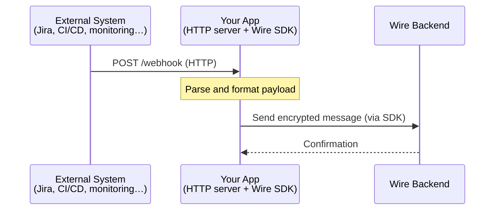
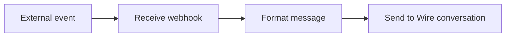
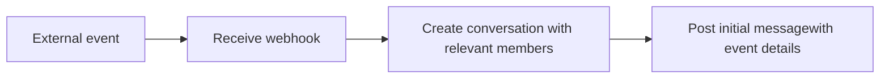
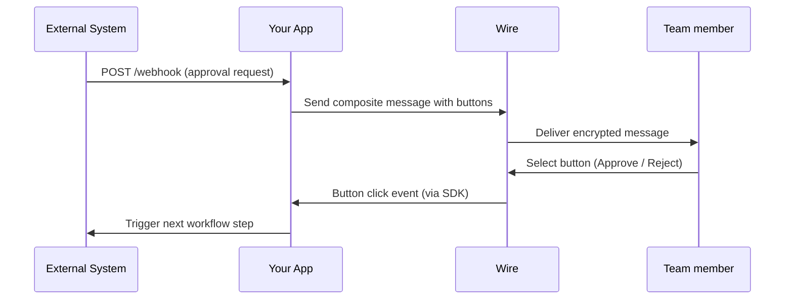

# Connecting external systems

Many business tools, monitoring platforms, ticketing systems, CI/CD pipelines or CRMs, can send an HTTP webhook whenever something happens. With the Wire SDK, you can receive those webhooks and turn them into Wire messages or conversations, keeping your team informed without leaving Wire.

Common examples include:

- **Jira or ServiceNow** webhook that posts a notification when a ticket opens or changes priority.
- **CI/CD pipeline** (GitHub Actions, Jenkins, GitLab) that alerts a team channel on a build failure or deployment.
- **monitoring tool** (PagerDuty, Grafana, Datadog) that fires an alert when a service degrades.
- **Zendesk or Salesforce** event that routes a new support request to the right Wire conversation.

## Encryption by default

On most collaboration platforms like Slack and Microsoft Teams, bots and integrations run on server infrastructure _outside_ the encrypted client boundary. The platform server can see message content before it reaches users.

In Wire it works differently. Your SDK app joins the conversation as a real encrypted participant. It holds encryption keys, encrypts and decrypts messages, and delivers notifications end-to-end encrypted from your app to every member of the conversation. The Wire server only routes encrypted data, it never sees the content.

This means you can pipe sensitive operational data (incident details, financial alerts, compliance notifications) into Wire conversations without it ever passing through an unencrypted layer.

## How it works

Your app sits between the external system and Wire. It runs two things at once:

1. An **HTTP server** that receives the incoming webhook from the external system.
2. The **Wire SDK** that sends messages or creates conversations in response.

Your app decides what to send. The raw webhook payload stays with you while Wire only receives the message you compose from it.

## Common patterns

### Notification pipeline

When an external event fires, post a formatted message to a known conversation. To make it more flexible, set the conversationId as part of the webhook URL or data to also have routing.

This covers most alerting and reporting scenarios: deployment notifications, monitoring alerts, daily summaries, ticket updates.

<!--
Use @site/showcase?tags=webhook when more webhook apps are present
-->
A good example of this is the **[GitHub App](https://github.com/wireapp/github-app)**:
1. the App exposes 1 endpoint and your GitHub org is configured with a web-hook to send events on every pull request being closed
2. The App receives the event via Rest and then uses the SDK to send an encrypted message in a Wire conversation. 

### Conversation per event

For events that need focused attention like a new incident, a critical ticket, a compliance request, your app can create a fresh conversation and add the relevant people to it. Each event gets its own thread, keeping discussions organised and searchable.

See [creating conversations](./03-developer-interface/02-interactions/03-create-conversation.md) for how to create group and one-to-one conversations with the SDK.

### Approval workflow

For workflows that require a decision like approvals, acknowledgements, escalations, send a composite message with buttons. When a team member selects an option, the SDK receives the button click event and your app can trigger the next step in the workflow, all within the encrypted Wire environment.

Learn how to [compose a message with buttons](./03-developer-interface/02-interactions/01-send-message.mdx#composite-message), and react [on buttons being clicked](./03-developer-interface/01-events/06-on-button-clicked.mdx).

## Securing your webhook endpoint

Before acting on a webhook, always verify it came from your external system. Most platforms sign their payloads with HMAC-SHA256 and include the signature in a request header. Reject any request where the signature doesn't match.

Store the webhook signing secret alongside your Wire API token, using a secrets manager or environment variable. See [managing app tokens](./05-secure-integration-guidelines/02-managing-app-tokens.md) for recommended storage approaches.

## Deployment considerations

Your app needs a stable, publicly accessible endpoint so the external system can reach it. If you're running behind a firewall or in a private network, you'll need to expose the webhook port or use a reverse proxy.

Review the [deployment tips](./04-deployment-tips/index.md) for guidance on hosting your app and making sure it stays reachable.
