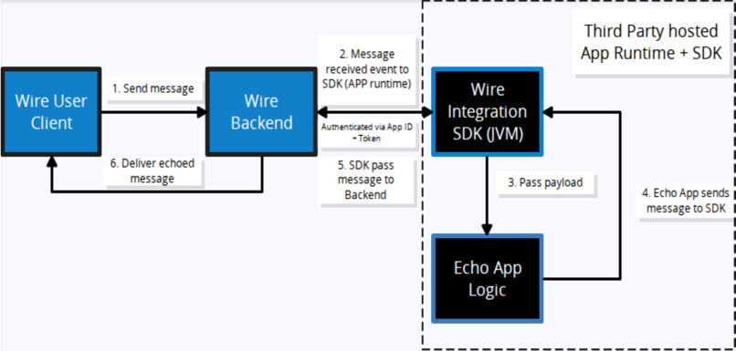

# Create App manually

:::info

In the actual production scenario, you do not need to do this
You will be able to Create an App from [Team management](./01-create-app.md),
and you only need App id and App token

:::

```mdx-code-block
import ReactPlayer from 'react-player'
```

<iframe src="https://drive.google.com/file/d/1ssrPVGFAXUmaq7CjDeZJDyXnGPcwlwgo/preview" width="100%" height="100%"></iframe>

## 1. Prerequisites

#### ✅ Install Java 17+

Check if Java is installed:
`java -version`

If not installed:
 - **macOS**:
    via terminal `brew install openjdk@17`
 - **Windows**:
    Download from Adoptium Temurin 17.

#### ✅ Install Gradle

Gradle is needed to manage dependencies.
Check if installed: 
`gradle -v`

If not:
 - **macOS**:
    via terminal `brew install gradle`
 - **Windows**:
    Use [Gradle Installer](https://gradle.org/install/) or `choco install gradle`.

#### ✅ Install IntelliJ IDEA

Download IntelliJ IDEA Community Edition from: 👉https://www.jetbrains.com/idea/download
IntelliJ is used for Kotlin/Gradle development and to run the bot easily. This demo uses this tool
Or You can use any other equivalent

#### ✅ Create a Team and User

Enter Team settings: https://wire-teams-dev.zinfra.io/

And get the following details
Wire Email
Wire Password
Wire User ID
Staging Domain : staging.zinfra.io

----

**Now You are 50% Done!**

Next Steps - This example is in Kotlin

## 2. Create a New Kotlin Project

1. Open IntelliJ → New Project
2. Choose:
   - Language: Kotlin
   - Build system: Gradle (Kotlin DSL)
   - JDK: Temurin 17
3. Name your project, e.g. TestApp

## 3. Configure Gradle Build

Open `build.gradle.kts` and replace everything with:

```kotlin
plugins {
    kotlin("jvm") version "2.2.20"
}

group = "org.example"
version = "1.0-SNAPSHOT"

repositories {
    mavenCentral()
}

dependencies {
    implementation("com.wire:wire-apps-jvm-sdk:0.0.17")
}

tasks.test {
    useJUnitPlatform()
}
kotlin {
    jvmToolchain(17)
}
```

Then click the *"Load Gradle Changes"* popup

## 4. Create Your Kotlin File

In IntelliJ:
 - Navigate to: `src/main/kotlin`
 - Right click -> New -> Kotlin Class file - Name as Main.kt
Go to `main.kt` and the copy the below Kotlin code for the simple echo app 

```kotlin
import com.wire.sdk.WireAppSdk
import com.wire.sdk.WireEventsHandlerSuspending
import com.wire.sdk.model.WireMessage
import java.util.UUID
fun main() {
    val wireAppSdk = WireAppSdk(
        applicationId = UUID.randomUUID(),
        apiToken = "myApiToken",
        apiHost = "https://staging-nginz-https.zinfra.io",
        cryptographyStoragePassword = "myDummyPasswordOfRandom32BytesCH",
        wireEventsHandler = SampleEventsHandler()
    )
    wireAppSdk.startListening()
}
class SampleEventsHandler : WireEventsHandlerSuspending() {
    override suspend fun onMessage(wireMessage: WireMessage.Text) {
        val message = WireMessage.Text.createReply(
            conversationId = wireMessage.conversationId,
            text = "echoing ${wireMessage.text}",
            originalMessage = wireMessage,
            mentions = wireMessage.mentions
        )
        manager.sendMessage(message)
    }
}
```

Run this to create `main.kt` configuration file

## 5. Configure Environment Variables

Go to:
 - Current File on the top
 - Click on the 3 dots
 - Run with parameter
 - Click on Edit environment variables

```.env
WIRE_SDK_USER_ID=abcd-1234-efgh-5678
WIRE_SDK_EMAIL=your_email@domain.com
WIRE_SDK_PASSWORD=dummyPassword
WIRE_SDK_ENVIRONMENT=my.domain.link
```


## 6. Run the App

Click the green play ▶️ button beside `fun main()` in IntelliJ

## 7. Use the App

 - Log in as a different user https://wire-webapp-dev.zinfra.io/
 - Create a Group
 - Add App into that Group
 - Invoke the App

#### Your First Echo App should Echo the message back!


