# Architecture

The SDK handles the complex work behind Wire: backend communication, encryption, and data storage.
This lets you focus on what your application needs to do.

Whether you’re building a chatbot, an integration, or custom workflow automation, the SDK gives you a clear, 
event-driven interface that manages the heavy lifting in the background.

## High-level diagram

```mermaid
architecture-beta
    group wireBackend(wire:cloud)[Wire Backend]
        service webSocketAPI(wire:server)[WebSocket API] in wireBackend
        service restAPI(wire:server)[REST API] in wireBackend
    
    webSocketAPI:R <--> L:eventListener
    restAPI:R <--> L:restClient
    
    group wireSDK(wire:attachment)[Wire SDK]
        service eventListener(wire:sync)[Events Listener] in wireSDK
        service restClient(wire:cloud)[REST Client] in wireSDK
        service crypto(wire:lock)[Crypto Module] in wireSDK
    
    junction junctionLeftUp in wireSDK
    junction junctionLeftMid in wireSDK
    junction junctionLeftDown in wireSDK
    restClient:R <-- L:junctionLeftDown
    eventListener:R -- L:junctionLeftUp
    
    junctionLeftDown:T -- B:junctionLeftMid
    junctionLeftUp:B -- T:junctionLeftMid
    
    junctionLeftMid:R --> L:crypto
    
    group devInterface(wire:desktop)[Developer Interface] in wireSDK
        service eventsRouter(wire:siren)[Events Handler] in devInterface
        service appManager(wire:settings)[Application Manager] in devInterface
    
    junction junctionMidUp in wireSDK
    junction junctionMidDown in wireSDK
    
    crypto:T -- B:junctionMidUp
    junctionMidUp:R --> L:eventsRouter
    
    crypto:B <-- T:junctionMidDown
    junctionMidDown:R -- L:appManager
    
    junction devInterfaceJunction in devInterface
    
    eventsRouter:B -- T:devInterfaceJunction
    appManager:T -- B:devInterfaceJunction
  
    devInterfaceJunction:R -- L:appLogic
    
    group devApp(wire:service)[Developer App]
      service appLogic(wire:compliant-1)[App Logic] in devApp
```

## Developer Application

Apps are independent software components that connect to Wire’s frontend and backend through a common protocol, 
such as APIs or events. They run on your systems, but they work smoothly with Wire and the people who use them.

An **App** helps you extend or automate how your team works in Wire. It can listen to messages, send replies, 
and connect Wire to external services you already use.

You’ll find basic examples in the `sample` directory at the root of the SDK repository.  
For more advanced scenarios, see the Showcase section.

<!-- TODO: add link once Showcase section is created -->

## Wire SDK

### Developer Interface

Create a `WireAppSdk` object to connect your app to Wire and listen for WebSocket events.  
These events include:
- Invitations to add your app to a Wire team
- Updates to user or app membership in a conversation
- Messages sent in a conversation

The SDK handles all underlying processing, so you can focus on the logic that matters to your app.

To receive events, implement `WireEventsHandler` and choose the event types you want to react to. 
Each method in the handler corresponds to a specific event.  
See [the class reference](@site/docs/04-events/index.md) for details on all available callbacks.

Both `WireAppSdk` and `WireEventsHandler` give you access to `WireApplicationManager`.  
This manager is your main entry point for working with app data and interactions. You can use it to:

- Access stored app information
- Send messages
- Fetch details about team members
- Create new conversations

<!-- TODO: Add link to `WireApplicationManager` reference once created -->

### Event listener

`WireTeamEventsListener` keeps your connection with each team active and in sync. 
It opens a WebSocket for every registered team, listens for new events, and handles errors so you don’t have to.

When a data frame arrives, the listener deserializes it into a notification that may contain one or more events. 
It then passes these events to `EventsRouter` and helps keep the SDK and Wire Backend aligned through incremental sync.

The listener manages the full WebSocket lifecycle. If a connection drops, it tries to reconnect. 
After processing a frame, it acknowledges the notification so the backend knows it’s been handled.

To track connection changes, implement `BackendConnectionListener`. 
It gives you simple callbacks when a connection is established or closed.

### Events Router

The `EventsRouter` receives incoming events and passes them to your `WireEventsHandler` implementation.  
It keeps conversations and memberships up to date, decrypts messages, and updates local storage automatically.

The router works with many event types such as team invitations, conversation updates, and encrypted messages, 
and sends each one to the right handler method.

### Storage layer

The SDK uses a local storage to keep essential data persistent between restarts.  
It’s simple, reliable, and built to support the way your app works with Wire.

The storage layer has three parts:

- **AppStorage**  
  Holds App-level settings in a small key–value store, including the device ID, feature flags, and any custom properties you set.

- **TeamStorage**  
  Keeps track of all teams that have invited your application.

- **ConversationStorage**  
  Saves conversation details such as IDs, names, types, MLS group IDs used for encryption and decryption, 
  team links, and member roles.

All components rely on SQLite through the `AppsSdkDatabase` schema, with transactions to help keep data consistent.  
The SDK creates the storage directory for you at `storage/apps.db`.

### Crypto module

`CoreCryptoClient` manages all cryptographic material and handles message encryption and decryption.  
It builds on the [CoreCrypto library](https://github.com/wireapp/core-crypto) and focuses on keeping conversations secure and consistent.

- **MLS support**  
  Uses the MLS protocol for secure group messaging with end-to-end encryption, forward secrecy, and protection after key compromise.

- **Key package management**  
  Creates and uploads MLS key packages and keeps the supply topped up automatically.

- **Message encryption and decryption**  
  Encrypts messages before they leave the device and decrypts messages as they arrive.

- **Group state management**  
  Maintains the cryptographic state for each conversation so messages stay in sync.

- **Secure storage**  
  Stores all cryptographic material in encrypted form, protected by the `cryptographyStoragePassword` you provide.

### REST Client

`BackendClient` is the interface for all HTTP communication with Wire backend, handling authentication, 
message transmission, conversation management, user/team data retrieval, and asset handling.

Key operations include: sending encrypted MLS messages and commit bundles, creating conversations, 
updating member roles, retrieving user profiles and team information, uploading/downloading encrypted files, 
and managing MLS protocol operations (uploading key packages, claiming key packages, retrieving public keys).

## Wire Backend

The Wire backend provides the infrastructure for real-time communication.  
The SDK connects to it through two primary channels: 
- **WebSocket API** — receives live events such as team invitations, conversation updates, and messages.
- **REST API** — performs actions like sending messages, updating conversations, and retrieving user details.

For a deeper look at how the backend works, see the [Wire-server documentation](https://docs.wire.com/latest/understand/overview.html). 
