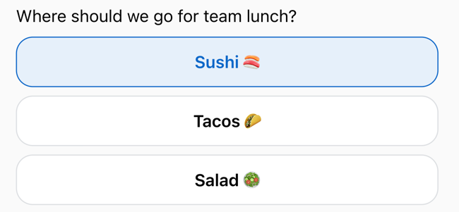

# `onCompositeMessageReceived`

A Composite message was received.  
Composite messages are a combination of text and buttons in a single message.

Only Apps can create Composite messages.
End clients can receive and display them, but cannot send them.
<!-- Based on that, should we really have a method to handle receiving Composite message? -->

## Received properties

Apart from [Base properties](../core-concepts/message-model.md#base-message-properties),
a `WireMessage.Composite` object includes a list of `Item` objects.

Each `Item` can be one of the following:
 - **`WireMessage.Text`** — A text element. See details in [onMessage event](./on-text-message-received.mdx#received-properties).
 - **`WireMessage.Button`** — An interactive element that lets users perform an action. Each button includes:
   - `text` — the label shown on the button.
   - `id` — a unique identifier for the button, automatically generated unless specified.

## Composite message on desktop

